**!! THIS REPOSITORY IS STILL UNDER CONSTRUCTION !!**

_Trouble viewing this? View on [GitHub](https://github.com/jordan9724/Photo-Editor/blob/master/README.md) or try the [PDF](README.pdf) version of this file._

**Table of Contents:**

[TOC]

# What is This?

Photo Editor is a way to easily programmatically edit images in Unity. If you need a super simplified way to quickly change an image at runtime, then this asset is perfect for you!

# Installation Instructions

## Asset Store - Recommended

> Note: The following was through the Unity app

1. Search "Photo Editor" via Unity's Asset Store
2. Click "Download"
3. Click "Import"
   - A small window should show up
4. Click "Import" on the "Import Unity Package" window

## GitHub

## Itch

# Quick Intro

## Highlights

- As of writing this, 5 stars on the Asset Store
- Extensive documentation
- Greatly commented
- Super easy way to programmatically edit photos
- FREE!

## Why I Made Photo Editor

- Initially needed a way to manipulate pictures programmatically
- Couldn't find another implementation

## What the Documentation Should Be

- Easy to follow/understand
- Straight to the point
- Clear and concise

# Ways to Contribute

## [Asset Store](http://u3d.as/xDZ)

- Leave a good rating
- Let others know what you experienced

## [GitHub](https://github.com/jordan9724/Photo-Editor)

- Give a star
- Report issues
- Make requests
- Submit pull requests

## [Itch](https://jordan97.itch.io/photo-editor)

- Give a donation
- Leave a rating
- Leave feedback via a comment

# Quick Start

## Imports

> First make a new C# script, then set up the imports:

```C#
using Picture_Editor_v2.Scripts;           // Contains Texture2DEditor class 
using Picture_Editor_v2.Scripts.Commands;  // Contains all of the commands
```

## Global Variables

> Make the global variables:

```C#
public MeshRenderer RendererToManipulate;          // Place to store the edited texture
public Texture2D Tex;                              // Original texture
private Texture2DEditor _myTextureEditorVariable;  // Changes (a copy of) the texture
```

## Start Method

> Used to make the edits to the photo:

```C#
void Start ()
{
   // Initialize the editor with the texture
   _myTextureEditorVariable = new Texture2DEditor(Tex);
   
   // Add commands in the order they should execute
   _myTextureEditorVariable.AddCommand(new Filter(Filters.Sepia));  // Adds a sepia filter
   _myTextureEditorVariable.AddCommand(new GaussianBlur(2));        // Next, blurs the image
   
   // Call "GetTexture2D" to get the new texture
   RendererToManipulate.sharedMaterial.mainTexture = _myTextureEditorVariable.GetTexture2D();
}
```

## Check File

> What your file should look like:

```C#
using Picture_Editor_v2.Scripts;           // Contains Texture2DEditor class 
using Picture_Editor_v2.Scripts.Commands;  // Contains all of the commands
using UnityEngine;

public class Test : MonoBehaviour
{
   public MeshRenderer RendererToManipulate;          // Place to store the edited texture
   public Texture2D Tex;                              // Original texture
   private Texture2DEditor _myTextureEditorVariable;  // Changes (a copy of) the texture

   void Start ()
   {
      // Initialize the editor with the texture
      _myTextureEditorVariable = new Texture2DEditor(Tex);
      
      // Add commands in the order they should execute
      _myTextureEditorVariable.AddCommand(new Filter(Filters.Sepia));  // Adds a sepia filter
      _myTextureEditorVariable.AddCommand(new GaussianBlur(2));        // Next, blurs the image
      
      // Call "GetTexture2D" to get the new texture
      RendererToManipulate.sharedMaterial.mainTexture = _myTextureEditorVariable.GetTexture2D();
   }
}
```

## Find Image

> Locate the image you want to edit

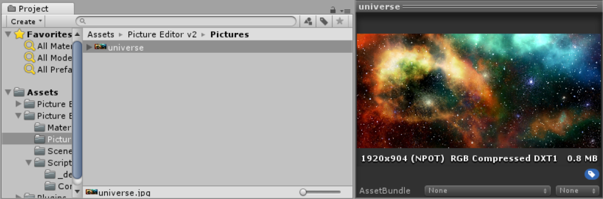

## Image Settings

> Enable "Read/Write" for the image (and hit apply)

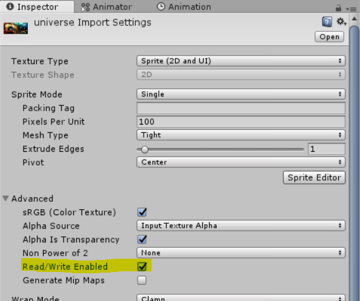

## Add Plane Object

> Add a plane object to the scene and set "Portrait Picture" as the material

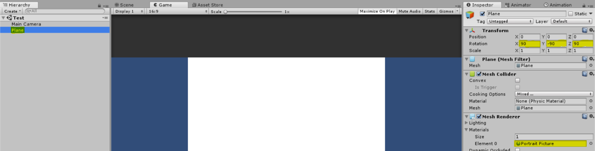

_Note: The image is saved to the material, so if you use this material on another object, it will be the same image. Simply make copies of the Portrait Picture material to use for other objects._

## Add Script

> Add a new object, and attach the C# script you just made in the previous steps (we've named ours `Test.cs`)

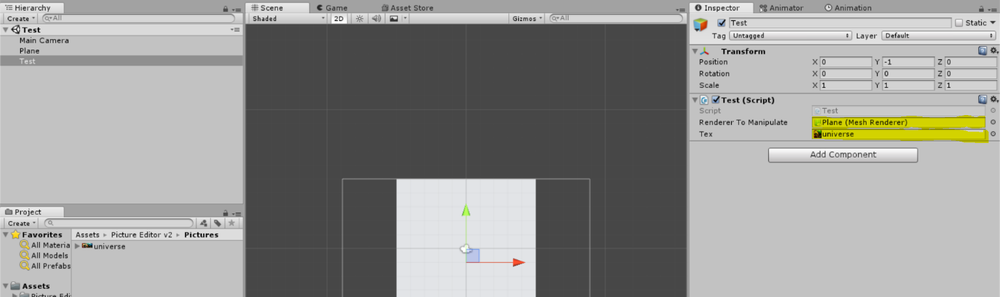

## Set Lighting

> The lighting tab is located under `Windows > Lighting > Settings`

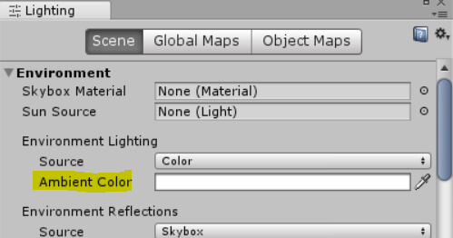

## Hit Play

> Time to look at the result!

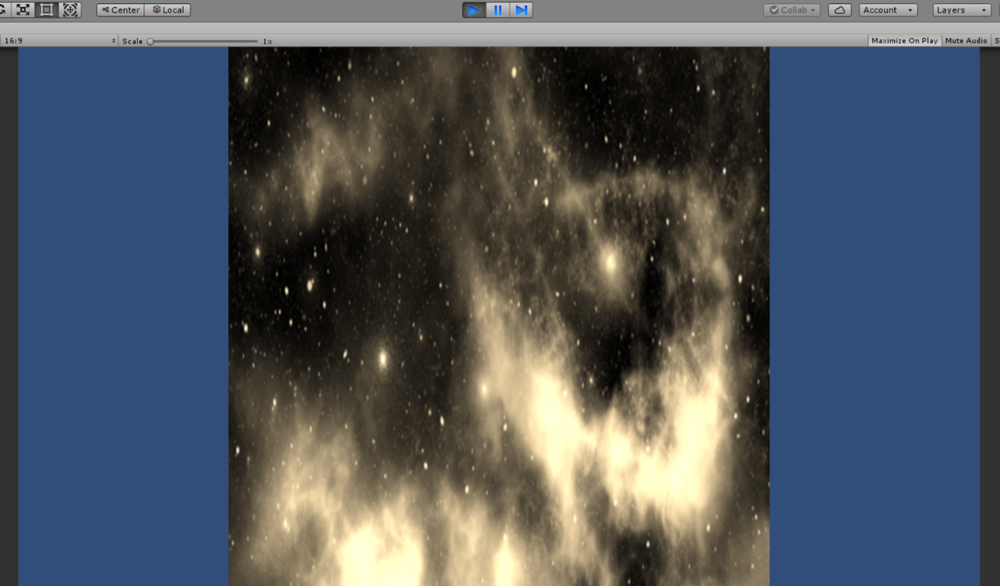

_Note: Since the plane object is square, our resulting image will also be square. Change the shape of the plane via its transform settings._

# Command Reference

## Scenario

Using texture:


> Following the [Quick Start](#Quick Start) guide, our file looks kind of like this:

```C#
using Picture_Editor_v2.Scripts;             // Contains Texture2DEditor class
using Picture_Editor_v2.Scripts.Commands;    // Contains all of the commands
using UnityEngine;

public class Test : MonoBehaviour
{
	public MeshRenderer RendererToManipulate;		    // Place to store the edited texture
	public Texture2D Tex;							  // Original texture
	private Texture2DEditor _myTextureEditorVariable;	// Changes (a copy of) the texture

	void Start ()
	{
		Texture2DEditor myEditor = new Texture2DEditor(Tex);

		// !! The following examples will replace the next line !!
		myEditor.AddCommand(<myCommand>);

		RendererToManipulate.sharedMaterial.mainTexture = myEditor.GetTexture2D();
	}
}
```

## Convolution

### Options

#### `convolution`

A 3x3 convolution, convolutions can be found in the `Convolutions.cs` file

#### `bias`

Float added to each RGB value after the convolution is applied

### Convolutions

> The following examples replace `myEditor.AddCommand(<myCommand>);` in the [Scenario](#Scenario) above

#### Edge Detection

Keeps edges in the image

```C#
myEditor.AddCommand(new Convolution(Convolutions.EdgeDetection));
```

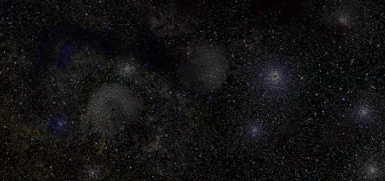

#### Edge Detection Depth

Keeps edges with their depth

```C#
myEditor.AddCommand(new Convolution(Convolutions.EdgeDetectionDepth));
```

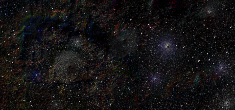

#### Edge Enhancement

Makes the edges in the image more clear

```C#
myEditor.AddCommand(new Convolution(Convolutions.EdgeEnhancement));
```


#### Emboss

Embosses the image. _Notice that bias is used._

```C#
myEditor.AddCommand(new Convolution(Convolutions.Emboss, 0.5f));
```

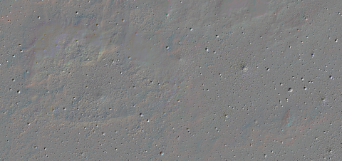

#### Emboss 45

Embosses the image the opposite way. _Notice that bias is used._

```C#
myEditor.AddCommand(new Convolution(Convolutions.Emboss45, 0.5f));
```

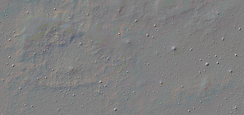

#### Emboss Depth

Similar to [Emboss 45](#Emboss 45), but blends the final image more. _Notice that bias is used._

```C#
myEditor.AddCommand(new Convolution(Convolutions.EmbossDepth, 0.5f));
```

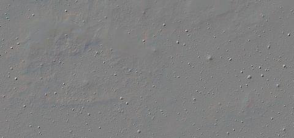

#### Emboss Intense

A much more dramatic emboss.  _Notice that bias is used._

```C#
myEditor.AddCommand(new Convolution(Convolutions.EmbossIntense, 0.5f));
```

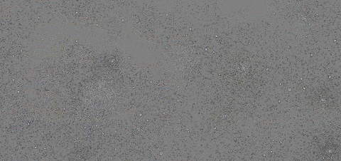

#### Sharpen

Makes the image more crisp

```C#
Texture2D newTexture = myEditor.GetTexture2D(fileName: path + "c_s_ex");
```

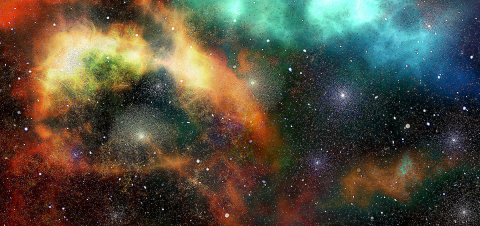

#### Sharpen Intense

Dramatically sharpens the image

```C#
myEditor.AddCommand(new Convolution(Convolutions.SharpenIntense));
```


#### Sharpen Medium

A happy medium between [Sharpen](#Sharpen) and [Sharpen Intense](#Sharpen Intense)

```C#
myEditor.AddCommand(new Convolution(Convolutions.SharpenMedium));
```


## Circle Crop

Used to apply a circular crop around the texture

> The following replaces `myEditor.AddCommand(<myCommand>);` in the [Scenario](#Scenario) above

```c#
myEditor.AddCommand(new CropCircle());
```


# How Commands Work

## Understanding `Texture2DEditor.AddCommand()`

Given scenario:

```C#
Texture2DEditor myEditor = new Texture2DEditor(myTexture);
myEditor.AddCommand(new Negative());
myEditor.AddCommand(new Multiplier(2));
myEditor.AddCommand(new CircleCrop());
```

Can be visually represented as:


## Understanding `Texture2DEditor.GetTexture2D()`

### Algorithm

1. Produces the new image pixel by pixel

2. At each pixel, it asks the previous command to give it the new pixel via `GetPixel()`

   1. Per our example, the new image invokes circle crop's `GetPixel()` at the current pixel
   2. Circle crop either returns the color `black` or it invokes multiplier's `GetPixel()`
   3. Then multiplier invokes negative's `GetPixel()` **before** the multiplier command is applied
   4. Negative will then get a copy of the original image's color at the current pixel

3. Next, once it has the new image, it will trim the image by default

   > Trimming removes any columns or rows located on the side of the image that only include clear pixels. _Clear pixels are usually a result from cropping the image._

### Visualization

Continuing from the previous scenario, calling `myEditor.GetTexture2D()` can be visualized as:

> :grey_exclamation: Notice that the placement of circle crop keeps the negative and multiplier command from performing extra computation, so it's a little faster


_Note: The image still has 5 pixels to process._

_Note: This image will not get trimmed._

### Trimming

Assuming the `black` pixels represent `clear` pixels:


# FAQ

**Will Photo Editor make changes to the original file?**

No, Unity only allows the copying of texture's colors.