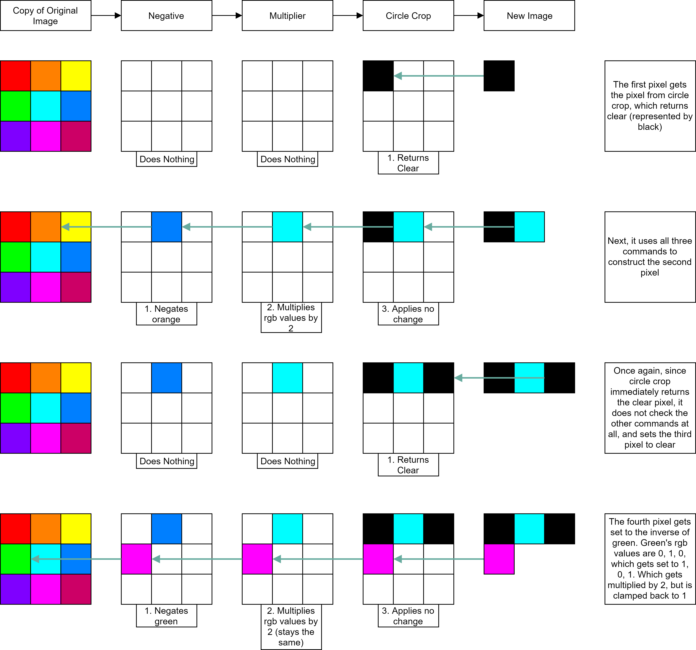
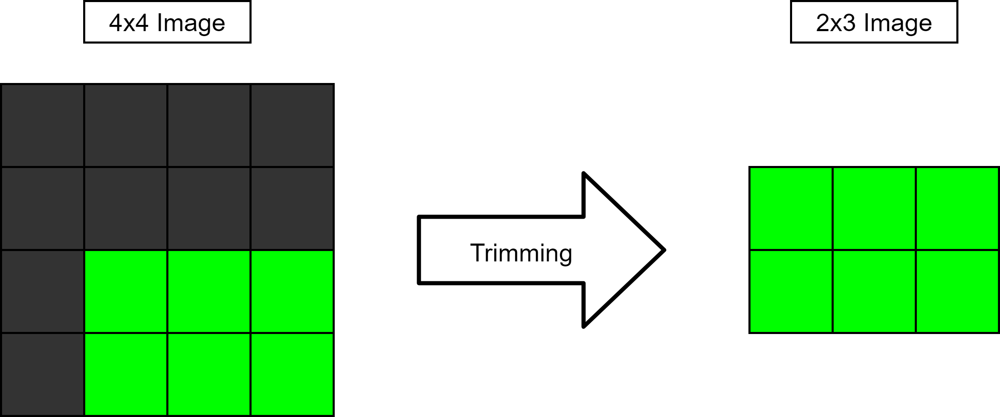

Trouble viewing this?

- Use [Typora](https://typora.io/) to view this file (which is what I used to edit)
- Or, view the [PDF](README.pdf) version of this file

Still need to complete:

- GitHub link
- Contact form
- Itch link
- "A Deeper Look" section (needs polishing)

**Table of Contents:**

[TOC]

# Quick Intro

Highlights:

- As of writing this, 5 stars on the Asset Store
- Extensive documentation
- Greatly commented
- Super easy way to programmatically edit photos
- FREE!

Why I made this:

- Initially needed a way to manipulate pictures programmatically
- Couldn't find another implementation

What this documentation is intended to be:

- Easy to follow/understand
- Straight to the point
- Clear and concise

# Ways to Contribute

## [Asset Store](http://u3d.as/xDZ)

- Leave a good rating
- Let others know what you experienced

## [GitHub]()

- Give a star
- Report issues
- Make requests
- Submit pull requests

## [Itch]()

- Give a donation
- Leave a rating
- Leave feedback via a comment

# Quick Start

## Imports

> First make a new C# script, then set up the imports:

```C#
using Picture_Editor_v2.Scripts;           // Contains Texture2DEditor class 
using Picture_Editor_v2.Scripts.Commands;  // Contains all of the commands
```

## Global Variables

> Make the global variables:

```C#
public MeshRenderer RendererToManipulate;          // Place to store the edited texture
public Texture2D Tex;                              // Original texture
private Texture2DEditor _myTextureEditorVariable;  // Changes (a copy of) the texture
```

## Start Method

> Used to make the edits to the photo:

```C#
void Start ()
{
   // Initialize the editor with the texture
   _myTextureEditorVariable = new Texture2DEditor(Tex);
   
   // Add commands in the order they should execute
   _myTextureEditorVariable.AddCommand(new Filter(Filters.Sepia));  // Adds a sepia filter
   _myTextureEditorVariable.AddCommand(new GaussianBlur(2));        // Next, blurs the image
   
   // Call "GetTexture2D" to get the new texture
   RendererToManipulate.sharedMaterial.mainTexture = _myTextureEditorVariable.GetTexture2D();
}
```

## Check File

> What your file should look like:

```C#
using Picture_Editor_v2.Scripts;           // Contains Texture2DEditor class 
using Picture_Editor_v2.Scripts.Commands;  // Contains all of the commands
using UnityEngine;

public class Test : MonoBehaviour
{
   public MeshRenderer RendererToManipulate;          // Place to store the edited texture
   public Texture2D Tex;                              // Original texture
   private Texture2DEditor _myTextureEditorVariable;  // Changes (a copy of) the texture

   void Start ()
   {
      // Initialize the editor with the texture
      _myTextureEditorVariable = new Texture2DEditor(Tex);
      
      // Add commands in the order they should execute
      _myTextureEditorVariable.AddCommand(new Filter(Filters.Sepia));  // Adds a sepia filter
      _myTextureEditorVariable.AddCommand(new GaussianBlur(2));        // Next, blurs the image
      
      // Call "GetTexture2D" to get the new texture
      RendererToManipulate.sharedMaterial.mainTexture = _myTextureEditorVariable.GetTexture2D();
   }
}
```

## Find Image

> Locate the image you want to edit


# How Commands Work

## Understanding of `Texture2DEditor.AddCommand()`

Given scenario:

```C#
Texture2DEditor myEditor = new Texture2DEditor(myTexture);
myEditor.AddCommand(new Negative());
myEditor.AddCommand(new Multiplier(2));
myEditor.AddCommand(new CircleCrop());
```

Can be visually represented as:


## Understanding `Texture2DEditor.GetTexture2D()`

### Algorithm

1. Produces the new image pixel by pixel

2. At each pixel, it asks the previous command to give it the new pixel via `GetPixel()`

   1. Per our example, the new image invokes circle crop's `GetPixel()` at the current pixel
   2. Circle crop either returns the color `black` or it invokes multiplier's `GetPixel()`
   3. Then multiplier invokes negative's `GetPixel()` **before** the multiplier command is applied
   4. Negative will then get a copy of the original image's color at the current pixel

3. Next, once it has the new image, it will trim the image by default

   > Trimming removes any columns or rows located on the side of the image that only include clear pixels. _Clear pixels are usually a result from cropping the image._

### Visualization

Continuing from the previous scenario, calling `myEditor.GetTexture2D()` can be visualized as:



_Note: The image still has 5 pixels to process._

_Note: This image will not get trimmed._

### Trimming

Assuming the `black` pixels represent `clear` pixels:



# FAQ

**Will Photo Editor make changes to the original file?**

No, Unity only allows textures to have their colors copied.